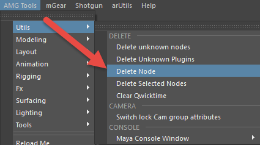

F.A.Q.
========

Reload Shotgun Maya
--------------------

.. error:: Ecли в Maya project folder не соответствует выбранному контексту - следует перезагрузить Shotgun в Maya

*всегда при обновлении паблишера делать перезагрузку шотгана в приложении*

перезагрузка шотгана внутри приложения:

.. image:: _templates/sg.png
	:scale: 100%
	:align: center

.. image:: _templates/sg_reload.png
	:scale: 100%
	:align: center
	
________

Runtime Error
--------------

.. error:: .. image:: _templates/run_error.png
________

Delete Node
-------------

при возникновении подобной проблемы:

.. error:: .. image:: _templates/delnod.png

следует нажаить *delete node:* в **AMG tools – utils:**

перед этим скопировав название ноды из шотгановского окна ошибки, и вставить в встроку ввода:

.. image:: _templates/delnod3.png

________

