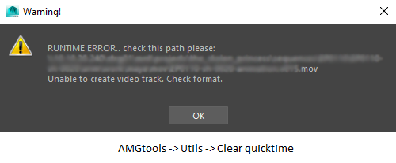
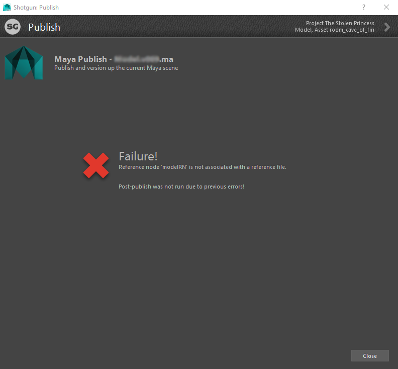
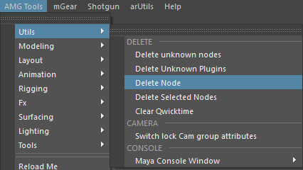
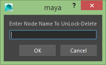

F.A.Q.
========

Ecли в Maya project folder не соответствует выбранному контексту - следует перезагрузить Shotgun в Maya:

:ref:`reload-shotgun-label`

.. _reload-shotgun-label:
________

runtime_error
--------------

________

.. error:: Блок **delete node** ``.. error::``
-------------

при возникновении подобной проблемы:

следует нажаить delete node: в AMG tools – utils:

перед этим скопировав название ноды из шотгановского окна ошибки, и вставить в встроку ввода тулзы:

________