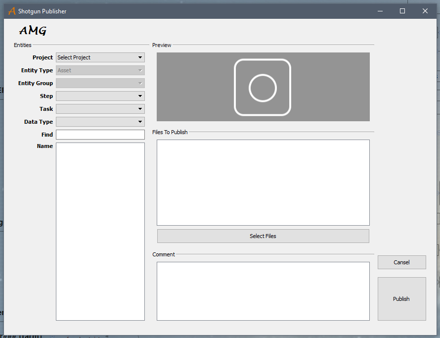

Modeling 
==========

 `modeling workflow <https://drive.google.com/file/d/0B3aO3ljSSlafVm5XcVF2NGJCUkE/view>`_
 
Publish Textures
------------------

Запускаем Shotgun Publisher "с ярлычка" sg_publisher на рабочем столе.

Выбираем проект из выпадающего списка проектов.

Устанавливаем нужный тип ассета в выпадающем списке типов ассета.

Выбираем нужный степ.

В нижнем списке имен ассетов выбираем нужный ассет, пользуемся полем Find для быстрого поиска. Если подходящего имени нет - проверяем тип ассета.

Из списка Data Type выбираем подходящий тип файла - для текстур:

	* Photoshop Image

или

	* Mari UDIM Image
_______

Закидываем подходящие тектуры в поле Files To Publish.

Для этого:

	* либо нажимаем кнопку Select Files,
	
	* либо в выпадающем меню по клику правой кнопкой выбираем Add Files,
	
	* либо закидываем драг-н-дропом

	
_______
	
**ВАЖНО:**

Название файла текстуры должно содержать короткое имя типа тектуры из следующего списка:
	
*'diff', 'spec', 'refl', 'glos', 'refr', 'norm', 'disp', 'bump', 'tran', 'emis', 'roug'*

**типы 'sss' и 'msk' пока не принимаются.**

Имя ассета в текстуре указывать не нужно - оно подставляется автоматически.

Версию тоже указывать не обязательно.

Тестуры могут содержать имя конкретного объекта в ассете - могут нет.

Если текстура расчитана на юдимы, нужно указывать номер юдима.

_______

Примеры:

	* "roof_diff.v008.1002.tif" *где "roof" - имя объекта*
	
	* "diff.v008.1002.tif"
	
	* "spec.v008.tif"
	
	* "norm.tif"

Все имена - в нижнем регистре.

Принимаются только TIFF файлы.

TIFF - только высокого разрешения.

Когда вы паблишите текстуру высокого разрешения, то PNG низкого разрешения создается автоматически.

Файлы в директориях **tex/high** и **tex/low** всегда создаются с версией 001 - и если что перезаписываются.

Версирование копий ведется в папке **tex/versions**.

Арнольдовские TX создаются автоматически только из **high-dimension-TIFF**-фалов и сохраняются в папку **tex/low**.

Для одного ассета можно паблишить одновременно несколько текстур одинакового разрешения.

Комментарий писать очень желательно.

Нажимаем кнопку Publish - появляется окошко с выбранным контекстом - внимательно его проверяем.

Если что-то не так - нажимаем Cancel и исправляем.

Если все нравится - жмем OK.

С нетерпением ждем окошко с надписью "Successful!"

После закрытия окошка список файлов очищается - так задумано.

Если что-то не нравится, пишем во Fleep в **bug repotr**